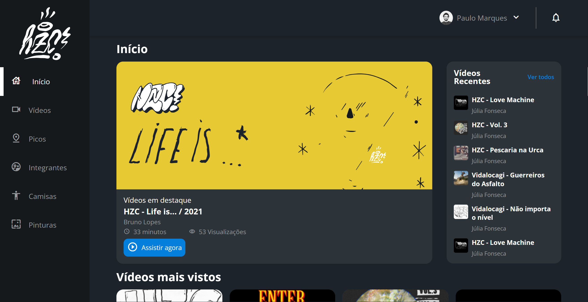

# HZC - Web Page

> CSS: Dispondo elementos com Flexbox e Grid

Projeto construído durante o curso ministrado pela instituição de ensino Alura.

[Clique aqui para acessar](https://paulomarquesdev.github.io/HZC---Web-Page/)

## Tecnologias

- HTML
- CSS
- JavaScript
- Git e Github
